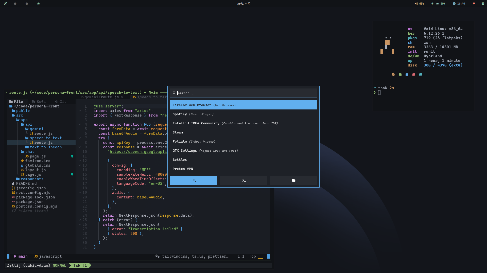

# 🌟 ab-dx/dotfiles


> **Modular, symlink-managed dotfiles for a clean and portable dev environment.**

## 🖼️ Preview



## 📚 Table of Contents

- [Features](#-features)
- [Dependencies](#-dependencies)
- [Quick Start](#-quick-start)
- [Adding New Configs](#-adding-new-configs)
- [Uninstall / Remove Symlinks](#-uninstall--remove-symlinks)
- [FAQ](#-faq)
- [Contributing](#-contributing)

## 📦 Features

- **Modular:** Each app/config has its own directory.
- **Symlinked:** Uses [GNU Stow](https://www.gnu.org/software/stow/) for simple management.
- **Portable:** Easily set up on any Unix-like system.
- **Versioned:** Track changes and roll back with Git.

## 📋 Dependencies

- [GNU Stow](https://www.gnu.org/software/stow/)
- [Nerd Fonts](https://github.com/ryanoasis/nerd-fonts)
- [Neovim](https://neovim.io/)
- [zellij](https://github.com/zellij-org/zellij)
- [starship](https://github.com/starship/starship)
- [alacritty](https://github.com/alacritty/alacritty)
- [rofi](https://github.com/davatorium/rofi)
- [waybar](https://github.com/Alexays/Waybar)
- [hyprland](https://github.com/hyprwm/Hyprland)
- [hyprlock](https://github.com/hyprwm/hyprlock/)
- [hyprpaper](https://github.com/hyprwm/hyprpaper)

## 🚀 Quick Start

### 1. **Clone the Repo**

```
git clone https://github.com/ab-dx/dotfiles.git ~/dotfiles
cd ~/dotfiles
```

### 2. **Install GNU Stow**

- **Debian/Ubuntu:**  
  `sudo apt install stow`
- **macOS (Homebrew):**  
  `brew install stow`
- **Arch:**  
  `sudo pacman -S stow`
- **Fedora:**  
  `sudo dnf install stow`
- **Void:**  
  `sudo xbps-install -S stow`

### 3. **Stow Everything**

From within the repo:

```
stow -t ~ .
```

This symlinks all configs into your home directory.

## ➕ Adding New Configs

1. Create a new directory (e.g., `zsh/`) in the repo.
2. Place your config files inside, matching their home directory paths.
3. Run `stow -t ~ .` again to symlink the new configs.

## 🧹 Uninstall / Remove Symlinks

To remove symlinks created by Stow:

```
stow -D -t ~ .
```

This will "unstow" all configs from your home directory.

## ❓ FAQ

**Q:** What if a config file already exists in my home directory?  
**A:** Move or back up the file before running `stow`, or use the `-v` flag for verbose output to see what Stow is doing.

**Q:** How do I only stow one app?  
**A:** Run `stow -t ~ <appname>` (e.g., `stow -t ~ nvim`).

**Q:** How do I update my dotfiles on another machine?  
**A:**

```
cd ~
git clone https://github.com/ab-dx/dotfiles.git
cd dotfiles
stow -t ~ .
```

**Q:** How do I keep my dotfiles up to date across machines?  
**A:**  
On each machine, just run:

```
git pull
stow -t ~ .
```

## 🤝 Contributing

PRs and suggestions are welcome! Please open an issue or pull request.

<p align="center">
  <b>✨ Happy hacking! ✨</b>
</p>
